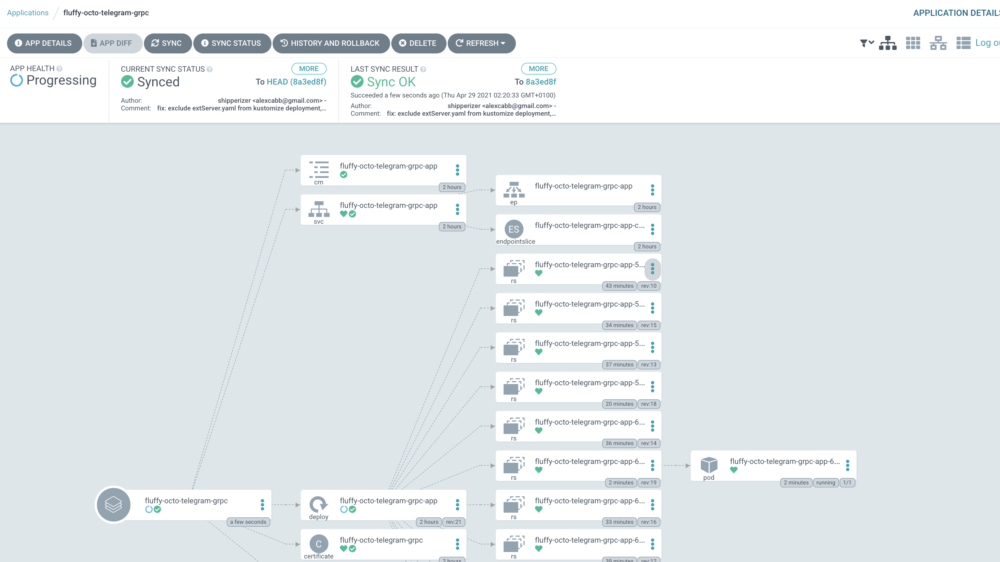

# fluffy-octo-telegram

Simple grpc app implementing envoy CheckRequest Protocol for Client Authorization

Currently it simply logs informations about the request coming in

```
pod/fluffy-octo-telegram-grpc-app-68b5b5ff64-r4qs9/fluffy-octo-telegram-grpc-app] time="2021-04-29T01:21:57Z" level=debug msg="request attributes.Request: time:{seconds:1619659317 nanos:447016000} http:{id:\"15956125687004427156\" method:\"GET\" headers:{key:\":authority\" value:\"api.shipperizer.org\"} headers:{key:\":method\" value:\"GET\"} headers:{key:\":path\" value:\"/api/v0/status\"} headers:{key:\":scheme\" value:\"https\"} headers:{key:\"accept-encoding\" value:\"gzip\"} headers:{key:\"content-type\" value:\"text/html\"} headers:{key:\"user-agent\" value:\"hey/0.0.1\"} headers:{key:\"x-envoy-internal\" value:\"true\"} headers:{key:\"x-forwarded-for\" value:\"192.168.86.1\"} headers:{key:\"x-forwarded-proto\" value:\"https\"} headers:{key:\"x-request-id\" value:\"e883eb25-6763-4bce-889e-797ecc562482\"} path:\"/api/v0/status\" host:\"api.shipperizer.org\" scheme:\"https\" protocol:\"HTTP/1.1\"}"
[pod/fluffy-octo-telegram-grpc-app-68b5b5ff64-r4qs9/fluffy-octo-telegram-grpc-app] time="2021-04-29T01:21:57Z" level=debug msg="request attributes.Source: address:{socket_address:{address:\"192.168.86.1\" port_value:57755}}"
[pod/fluffy-octo-telegram-grpc-app-68b5b5ff64-r4qs9/fluffy-octo-telegram-grpc-app] time="2021-04-29T01:21:57Z" level=debug msg="request attributes.ContextExtension: map[]"
[pod/fluffy-octo-telegram-grpc-app-68b5b5ff64-r4qs9/fluffy-octo-telegram-grpc-app] time="2021-04-29T01:21:57Z" level=debug msg="request attributes.Destination: address:{socket_address:{address:\"10.42.0.101\" port_value:8443}} principal:\"api.shipperizer.org\""
[pod/fluffy-octo-telegram-grpc-app-68b5b5ff64-r4qs9/fluffy-octo-telegram-grpc-app] time="2021-04-29T01:21:57Z" level=debug msg="request attributes.MetadataContext: "
[pod/fluffy-octo-telegram-grpc-app-68b5b5ff64-r4qs9/fluffy-octo-telegram-grpc-app] time="2021-04-29T01:21:57Z" level=debug msg="request attributes.Request: time:{seconds:1619659317 nanos:321078000} http:{id:\"1329126468091730213\" method:\"GET\" headers:{key:\":authority\" value:\"api.shipperizer.org\"} headers:{key:\":method\" value:\"GET\"} headers:{key:\":path\" value:\"/api/v0/status\"} headers:{key:\":scheme\" value:\"https\"} headers:{key:\"accept-encoding\" value:\"gzip\"} headers:{key:\"content-type\" value:\"text/html\"} headers:{key:\"user-agent\" value:\"hey/0.0.1\"} headers:{key:\"x-envoy-internal\" value:\"true\"} headers:{key:\"x-forwarded-for\" value:\"192.168.86.1\"} headers:{key:\"x-forwarded-proto\" value:\"https\"} headers:{key:\"x-request-id\" value:\"ba15b8d3-d828-418a-923b-1c8daae4b43d\"} path:\"/api/v0/status\" host:\"api.shipperizer.org\" scheme:\"https\" protocol:\"HTTP/1.1\"}"
[pod/fluffy-octo-telegram-grpc-app-68b5b5ff64-r4qs9/fluffy-octo-telegram-grpc-app] time="2021-04-29T01:21:57Z" level=debug msg="request attributes.Source: address:{socket_address:{address:\"192.168.86.1\" port_value:57731}}"
[pod/fluffy-octo-telegram-grpc-app-68b5b5ff64-r4qs9/fluffy-octo-telegram-grpc-app] time="2021-04-29T01:21:57Z" level=debug msg="request attributes.ContextExtension: map[]"
[pod/fluffy-octo-telegram-grpc-app-68b5b5ff64-r4qs9/fluffy-octo-telegram-grpc-app] time="2021-04-29T01:21:57Z" level=debug msg="request attributes.Destination: address:{socket_address:{address:\"10.42.0.101\" port_value:8443}} principal:\"api.shipperizer.org\""
[pod/fluffy-octo-telegram-grpc-app-68b5b5ff64-r4qs9/fluffy-octo-telegram-grpc-app] time="2021-04-29T01:21:57Z" level=debug msg="request attributes.MetadataContext: "
[pod/fluffy-octo-telegram-grpc-app-68b5b5ff64-r4qs9/fluffy-octo-telegram-grpc-app] time="2021-04-29T01:21:57Z" level=debug msg="request attributes.Request: time:{seconds:1619659317 nanos:320170000} http:{id:\"86128091661570278\" method:\"GET\" headers:{key:\":authority\" value:\"api.shipperizer.org\"} headers:{key:\":method\" value:\"GET\"} headers:{key:\":path\" value:\"/api/v0/status\"} headers:{key:\":scheme\" value:\"https\"} headers:{key:\"accept-encoding\" value:\"gzip\"} headers:{key:\"content-type\" value:\"text/html\"} headers:{key:\"user-agent\" value:\"hey/0.0.1\"} headers:{key:\"x-envoy-internal\" value:\"true\"} headers:{key:\"x-forwarded-for\" value:\"192.168.86.1\"} headers:{key:\"x-forwarded-proto\" value:\"https\"} headers:{key:\"x-request-id\" value:\"7c1522d7-9983-4333-9ee5-0c742e61e50f\"} path:\"/api/v0/status\" host:\"api.shipperizer.org\" scheme:\"https\" protocol:\"HTTP/1.1\"}"
[pod/fluffy-octo-telegram-grpc-app-68b5b5ff64-r4qs9/fluffy-octo-telegram-grpc-app] time="2021-04-29T01:21:57Z" level=debug msg="request attributes.Source: address:{socket_address:{address:\"192.168.86.1\" port_value:57756}}"
[pod/fluffy-octo-telegram-grpc-app-68b5b5ff64-r4qs9/fluffy-octo-telegram-grpc-app] time="2021-04-29T01:21:57Z" level=debug msg="request attributes.Source: address:{socket_address:{address:\"192.168.86.1\" port_value:57771}}"
```

## JWK

Use [`step cli`](https://smallstep.com/docs/step-cli/reference/crypto/jwk/create) to create a jwk, then create a k8s secret with it

```
step crypto jwk create jwk.pub.json jwk.json  --kty=EC --use=sig --crv=P-521 --no-password --insecure

kubectl create secret generic jwk-pub --from-file=jwk.pub.json
kubectl create secret generic jwk-priv --from-file=jwk.json
```

secrets will need to be mounted via volume (k8s for deployment, docker-compose for local dev)

will use env vars to determine path


## Build and deploy

Build setup is for multiarch support, a requirements for this is  [buildx](https://docs.docker.com/buildx/working-with-buildx/)

For `skaffold` integration i followed the suggestion [here](https://github.com/GoogleContainerTools/skaffold/tree/master/examples/custom-buildx) as ther eis no direct integration between `skaffold` and `buildx`


Images are pushed to `ghcr.io/shipperizer/fluffy-octo-telegram-grpc-app`, `k3s` cluster has a secret allowing it to pull them, see the snippet below in `deployments.yaml`

```
containers:
- image: ghcr.io/shipperizer/fluffy-octo-telegram-grpc-app
  name: fluffy-octo-telegram-grpc-app
  envFrom:
    - configMapRef:
        name: fluffy-octo-telegram-grpc-app
  name: fluffy-octo-telegram-grpc-app
  ports:
  - name: http
    containerPort: 8000
imagePullSecrets:
- name: regcred-github
```


*** `deployments/kustomize/extServer.yaml` will have to be deployed manually via kubectl, argocd won't do it as it errors with the following***
```
Unable to create application: application spec is invalid: InvalidSpecError: Unable to get app details: rpc error: code =
Unknown desc = `kustomize build /tmp/git@github.com_shipperizer_fluffy-octo-telegram/deployments/kustomize` failed exit
status 1: Error: accumulating resources: 2 errors occurred:
* accumulateFile error: "accumulating resources from 'extServer.yaml': evalsymlink failure on '/tmp/git@github.com_shipperizer_fluffy-octo-telegram/deployments/kustomize/extServer.yaml' : lstat /tmp/git@github.com_shipperizer_fluffy-octo-telegram/deployments/kustomize/extServer.yaml: no such file or directory"
* loader.New error: "error loading extServer.yaml with git: url lacks orgRepo: extServer.yaml, dir: evalsymlink failure on '/tmp/git@github.com_shipperizer_fluffy-octo-telegram/deployments/kustomize/extServer.yaml' : lstat /tmp/git@github.com_shipperizer_fluffy-octo-telegram/deployments/kustomize/extServer.yaml: no such file or directory, get: invalid source string: extServer.yaml"
```


### Kaniko

For `kaniko` builds, use the `--profile kaniko` modifier on `skaffold`, for this you will need an `Opaque` secret:

```
 echo '{"auths":{"ghcr.io":{"auth":"****************"}}}' | kubectl create secret generic regcred-github-kaniko --from-file=config.json=/dev/stdin
 ```

the profile is targeted at building on an `arm64` cluster only, if you need to use a different arch change `initImage` and `image` values

## ArgoCD

ArgoCD is used (together with ArgoCD image updater) to keep application up-to-date

see the `argocd.yaml` for extra informations
local setup will be described eventually in here, step by step


